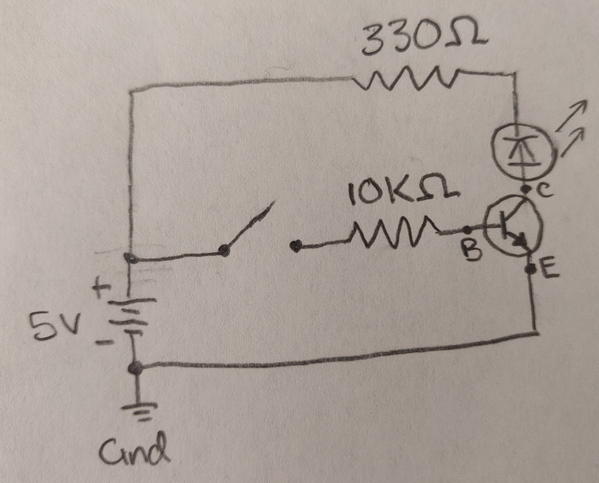
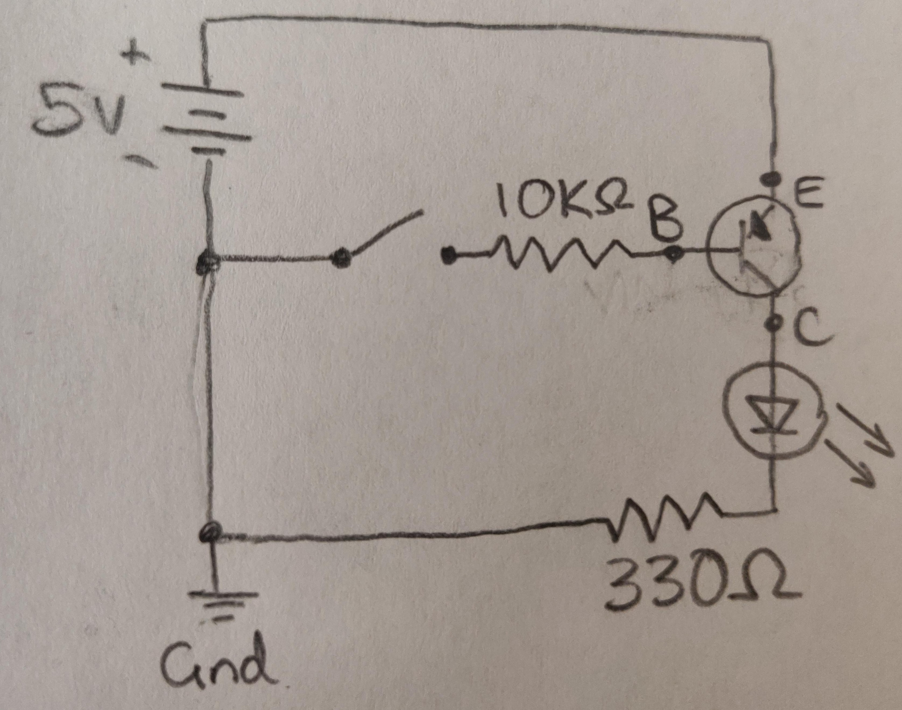

# CPE 1040 - Spring 2020

## Assignment 5: Transistors

Author: Grant, Brendan  
Last updated: 2020-03-10  

### 1. NPN Transistor Circuit (2N3904)

*Voltage Measurements:*

| Location      | Switch Off    | Switch On  |
|:-------------:|:-------------:|:----------:|
| Across R (RC)     | 0.005mV       | 1.003V     |
| At Collector (C) | 0.3mV         | 38.7mV     |
| At Base (B)      | -0.032mV      | 0.691V     |
| At Emitter (E)   | -0.000mV      | 1.4mV      |

*Current Measurements:*

| Location      | Switch Off    | Switch On  |
|:-------------:|:-------------:|:----------:|
| At Collector (IC)  | 0.002µA       | 3.052mA    |
| At Base (IB)      | 0.000µA       | 3.371mA    |
| At Emitter (IE)   | 0.000µA       | 0.315mA    |

These three currents are approximately zero when the input switch is off and become substantially higher when the switch is on. In the on state, the base and collector currents are much higher than the emitter current.

IC / IB * 100 = 90.5%

### 2. PNP Transistor Circuit (2N3906)

*Voltage Measurements:*

| Location      | Switch Off    | Switch On  |
|:-------------:|:-------------:|:----------:|
| Across R (RC)     | 0.975V        | -0.038mV   |
| At Collector (C) | 3.750V        | 1.033V     |
| At Base (B)      | 4.435V        | 0.557V     |
| At Emitter (E)   | 4.546V        | 0.558V     |

*Current Measurements:*

| Location      | Switch Off    | Switch On  |
|:-------------:|:-------------:|:----------:|
| At Collector (IC) | 11.14µA       | 0.001µA    |
| At Base (IB)      | 2.968mA       | 0.166µA    |
| At Emitter (IE)   | 2.964mA       | 0.000µA    |

These three currents have the opposite behavior of the NPN transistor: they are zero when the input switch is on and become substantially higher when the switch is off. In the off state, the base and emitter currents are much higher than the collector current.

IC / IB * 100 = 0.4%

### 3. Soil Sensor

1. The soil moisture probe uses an NPN transistor (the 2N3904 model tested above), one 100Ω resistor, and one 10KΩ resistor. Current flows towards the probes, but on the probe1 side it is blocked as it enters the collector side of the transistor. On the probe2 side, current flows through the 100Ω resistor and through the probe2 contacts. Current from the probe2 side then reaches the probe1 side which powers the base of the transistor. As a result, current can flow through the transistor to the signal contacts and finally through the 10KΩ resistor to ground. The transistor allows the current flowing through the soil to be amplified by the input power.

2. The resistance of full-soaked soil should be very similar to the resistance value when the probe contacts are dipped in water, because the water is the part of soaked soil that allows current to flow.

*Soil Resistance Measurements:*

| Measurement | Resistance    |
|:-------------:|:-------------:|
| RDRY | OVERLOAD |
| RWET | 3MΩ |
| RSOAK | 700KΩ |

3. The base voltage of the transistor can be measured by connecting the DMM to probe 1 and the ground on the microbit.

| Measurement | Voltage    |
|:-------------:|:-------------:|
| VBDRY | 3.152V |
| VBWET | 3.202V |
| VBSOAK | 3.916V |

7. The manual calibration program initially does not display anything. When the A button is pressed, the microbit reads the moisture sensor and sets the value read as the minimum for the map. When the B button is pressed the same is done for the maximum value. Once both of these values have been initialized, the main program runs which reads the moisture level, maps the input to between 0 and 4, and displays the read value as rows on the screen. The program pauses for two seconds between each reading.
[Video Demonstration](https://i.imgur.com/CExbKWx.mp4)

### 4. Automatic Calibration

2. This program is a modified version of the manual calibration version. Instead of using the buttons, the auto-calibration mode is triggered by the forever loop until the values for min and max have been initialized. This code first displays a down arrow to prompt the user to take a lower bound reading. Three of these readings are taken, and then an up arrow is displayed before the user immerses the prongs in water for the upper bound readings.
[Video Demonstration](https://i.imgur.com/c3DJ97G.mp4)

### 5. Project Extensions

1. The program adds to the auto-calibration code, but with an array of led pins initialized at the beginning and a couple of lines of code added to the display function. The display function now uses two for-loops to initially turn all of the leds off, then to turn on the leds corresponding to the amount of moisture being sensed.
[Video Demonstration](https://i.imgur.com/S8jeEJc.mp4)

2.
